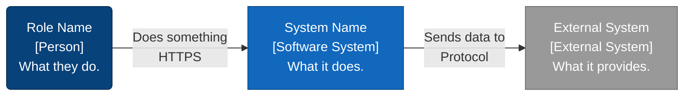
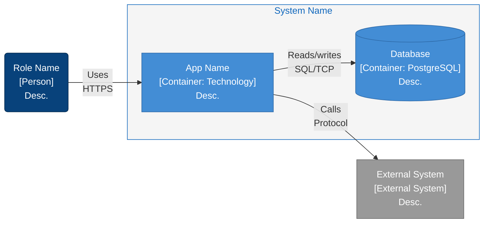
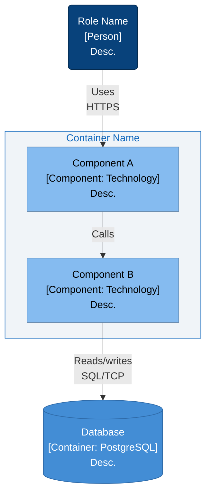
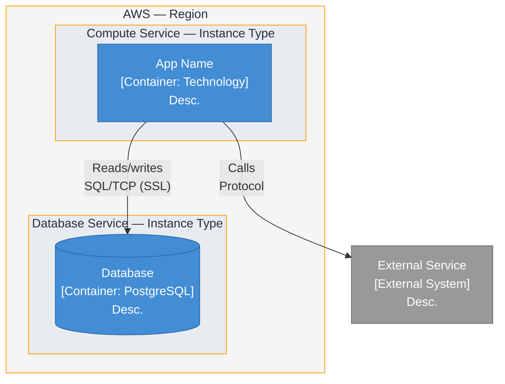
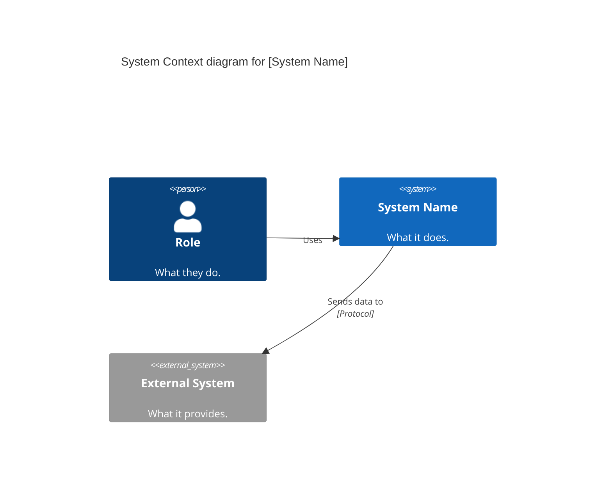
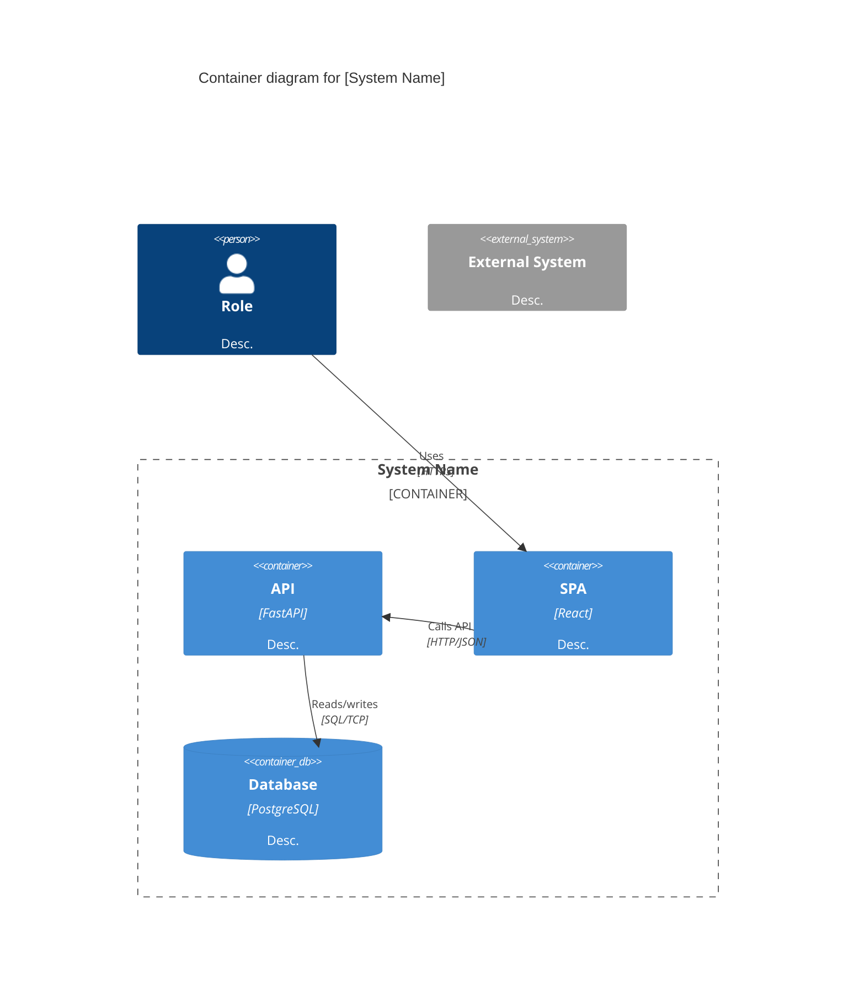
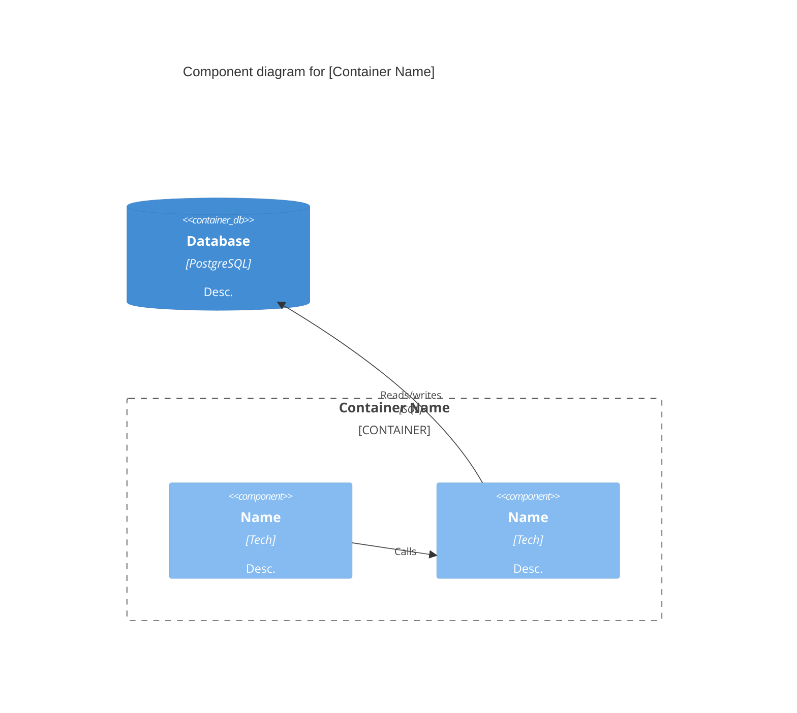
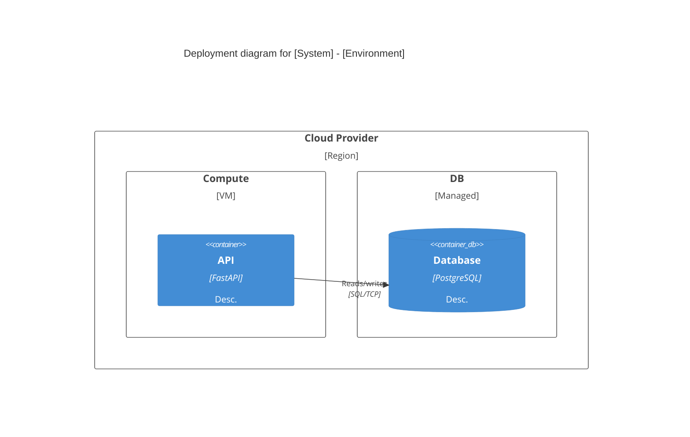

# C4 Architecture Modeling

Hierarchical abstractions and diagrams for software architecture static structure. Diagrams use **Mermaid `flowchart` syntax** with subgraphs, styled nodes, and labeled edges — the only approach that renders on GitHub today (July 2026). GitHub's Mermaid renderer does not bundle the C4 module; `C4Context` / `C4Container` / `C4Component` / `C4Deployment` syntax will not render.

## 1. Abstractions

**Person** — human user. Always outside the system boundary.

**Software System** — what a single team builds, owns, deploys. Contains containers. External systems you depend on (don't own) are also `Software System`.

**Container** — runtime unit (application or data store). *Not* Docker. Must be running (code or storage) for the system to work. Every container has a **technology** label. Categories: server-side web app, client-side SPA, mobile/desktop app, serverless function, RDBMS (one schema per container), document/blob store, message queue, CLI/script. SPA + separate API → **2 containers** (separate processes, HTTP/JSON). Server-rendered HTML → **1 container**.

**Component** — grouping of related functionality inside a single container behind a well-defined interface. Not separately deployable. If two pieces communicate over network (HTTP, gRPC, MQ) → **different containers**, not different components. In OOP: classes/interfaces behind an API. In JS/TS: module(s). In FP: module of related functions/types.

**Not covered**: Code level (classes/interfaces/functions), System Landscape diagrams, Dynamic diagrams.

## 2. Style Conventions

Use `classDef` for element type colors and `style` for subgraph boundary colors. Always include the class definitions and class assignments in every diagram.

| Abstraction | Node Shape | ClassDef Color | Stroke |
|---|---|---|---|
| Person | `("...")` rounded | `fill:#08427B,color:#fff` | `stroke:#042A4E` |
| Software System | `["..."]` rect | `fill:#1168BD,color:#fff` | `stroke:#0B4880` |
| External System | `["..."]` rect | `fill:#999999,color:#fff` | `stroke:#6B6B6B` |
| Container | `["..."]` rect | `fill:#438DD5,color:#fff` | `stroke:#2E6AA8` |
| ContainerDb | `[("...")]` cylinder | `fill:#438DD5,color:#fff` | `stroke:#2E6AA8` |
| Component | `["..."]` rect | `fill:#85BBF0,color:#000` | `stroke:#5D82A8` |
| Function/Stored Proc | `["..."]` rect | `fill:#6DAB7F,color:#fff` | `stroke:#4A7A5A` |

**Subgraph boundaries** (`style ...`):
- System boundary: `fill:#f5f5f5,stroke:#1168BD,color:#1168BD`
- Container boundary: `fill:#f0f4f8,stroke:#1168BD,color:#1168BD`
- Schema boundary (inside DB): `fill:#e8ecf0,stroke:#999,color:#000`
- AWS region boundary: `fill:#f5f5f5,stroke:#FF9900,color:#232F3E`
- AWS service boundary: `fill:#e8ecf0,stroke:#FF9900,color:#232F3E`

## 3. Diagram Types

### System Context
Scope: single system. Primary: the system box. Supporting: people + external systems. Audience: everyone. **Always create.**



### Container
Scope: single system. Primary: containers inside boundary. Audience: technical. **Always create.**



### Component
Scope: single container. Audience: developers/architects. **Optional** — only for containers with significant internal complexity.



### Deployment
Scope: one environment. Audience: technical + infra/ops. One per environment (production at minimum).



## 4. Notation Rules

**Titles**: Not supported in flowchart mode. The diagram type and scope are conveyed by node labels and subgraph titles instead.

**Element naming**: Person = role/job title. System = proper name. Container/Component = descriptive singular noun. **Every node** must include its C4 element type in brackets: `[Person]`, `[Software System]`, `[Container: Tech]`, `[Component: Tech]`. Keep descriptions to 1-2 sentences. Acronyms spelled out on first use.

**Relationships**: Every edge must be labeled with `|"label"|` and include protocol for inter-container edges (e.g. `\nSQL/TCP`, `\nHTTPS`). Be specific — avoid "Uses" (allowed only Person→System).

**Styling**: All classDef/style declarations go at the bottom of the diagram, after all nodes and edges. Never use decoration-only styling. Only add custom colors when encoding meaning (e.g. green for SECURITY DEFINER functions).

## 5. Directory Structure

```
docs/architecture/
├── README.md
├── diagrams/
│   ├── system-context/system-context.mmd
│   ├── containers/containers.mmd
│   ├── components/<container-name>/components.mmd
│   └── deployment/deployment-<environment>.mmd
```

One `system-context.mmd` and `containers.mmd` per system. One `components.mmd` per container subdirectory (kebab-case). One `deployment-<env>.mmd` per environment. All `.mmd` files contain a ` ```mermaid ` block — diffable, GitHub-rendered.

## 6. Workflow

1. **Context**: System, users, external deps → `system-context/system-context.mmd`
2. **Containers**: Decompose into apps/data stores, add protocols → `containers/containers.mmd`
3. **Components** (opt): Complex containers → `components/<name>/components.mmd`
4. **Deployment**: Map to infra → `deployment/deployment-poc.mmd`
5. **Review**: Run checklist on each diagram
6. **Index**: Update `README.md`

## 7. Review Checklist

- [ ] Every node includes C4 element type in brackets?
- [ ] Every node has a 1-2 sentence description?
- [ ] Every edge labeled with description and protocol (if inter-container)?
- [ ] classDef for each C4 abstraction present and applied?
- [ ] Subgraph boundaries styled with fill/stroke/color?
- [ ] (Deployment) Environment identified? Nodes labeled with infra type?

## 8. Tips

- Context + Container suffice for most teams. Component only when it clarifies.
- Update diagrams in same PR as architecture changes.
- Use `flowchart LR` for context/container (left-to-right), `flowchart TB` for component/deployment (top-to-bottom) — components have more nodes and fit better vertically.
- Paid external services you configure (S3, RDS) → **Containers** inside your boundary. You own the buckets/schemas.
- For database component diagrams, use `[Table]` and `[SECURITY DEFINER function]` type tags inside schema subgraphs.

## Appendix: Native C4 Syntax (Reference Only)

GitHub does **not** render this syntax as of July 2026. Keep this section as a migration target for when GitHub adds C4 module support. Until then, `.mmd` files must use the flowchart syntax above.

### System Context (`C4Context`)


### Container (`C4Container`)


### Component (`C4Component`)


### Deployment (`C4Deployment`)


### Native C4 Quick Reference

| Keyword | Abstraction |
|---|---|
| `Person(id, "Name", "Desc")` | Human user |
| `Person_Ext(id, "Name", "Desc")` | External person (rare) |
| `System(id, "Name", "Desc")` | Internal software system |
| `System_Ext(id, "Name", "Desc")` | External software system |
| `SystemDb(id, "Name", "Desc")` | External database |
| `Container(id, "Name", "Tech", "Desc")` | Application runtime |
| `ContainerDb(id, "Name", "Tech", "Desc")` | Data store |
| `Component(id, "Name", "Tech", "Desc")` | Functionality grouping |
| `Deployment_Node(id, "Name", "Type") { }` | Infrastructure node (nestable) |
| `Container_Boundary(id, "Name") { }` | Group components/containers |
| `System_Boundary(id, "Name") { }` | Group containers within a system |
| `Enterprise_Boundary(id, "Name") { }` | Group systems by org |

*Sources: [c4model.com](https://c4model.com) by Simon Brown, Mermaid documentation.*
