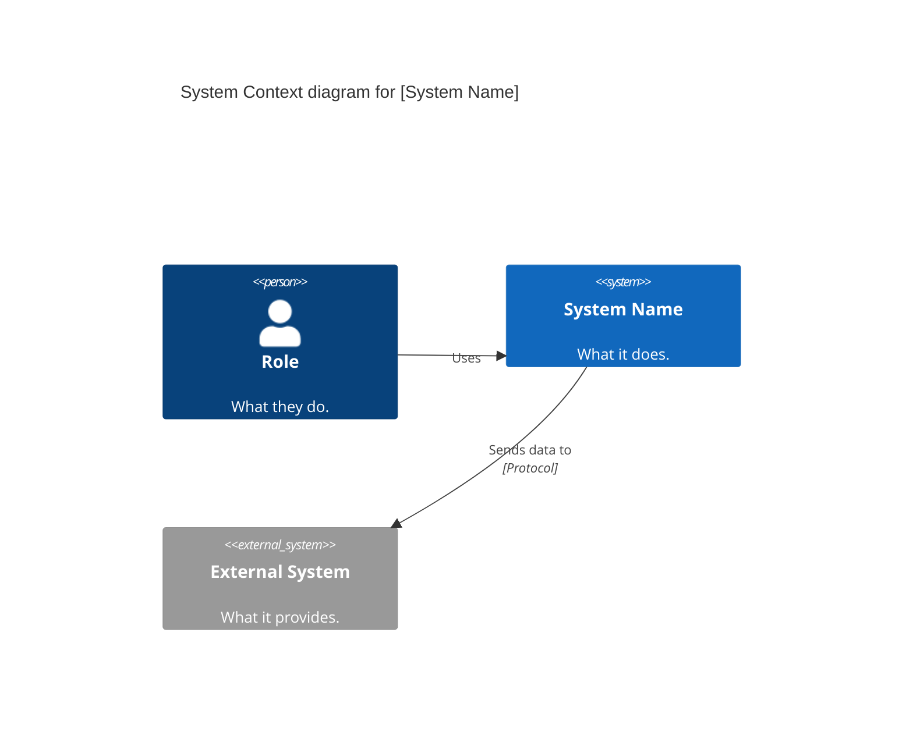
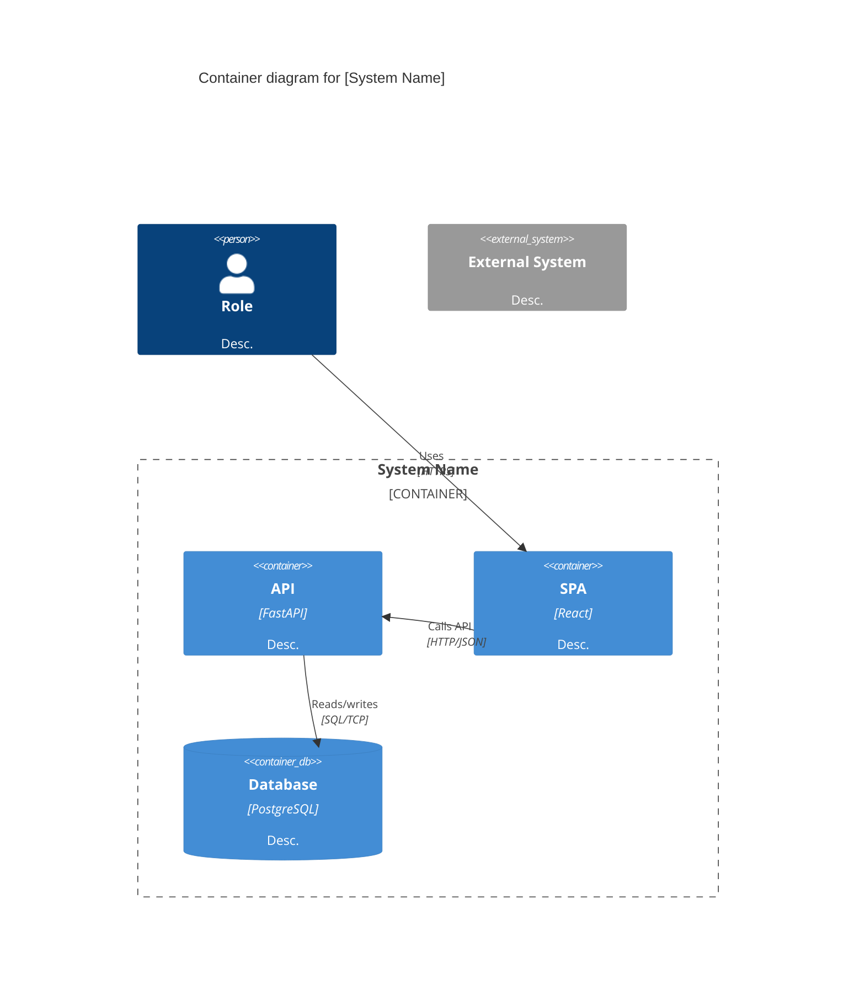
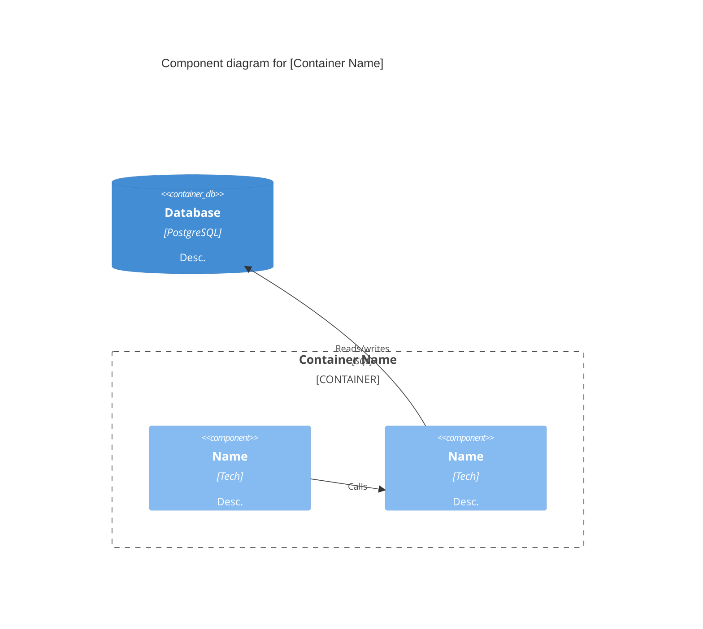
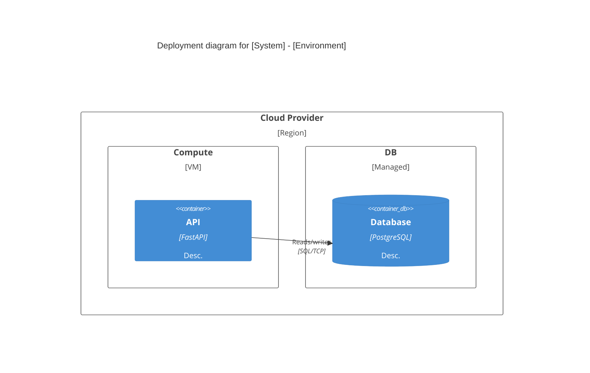

# C4 Architecture Modeling

Hierarchical abstractions and diagrams for software architecture static structure. Diagrams in **Mermaid C4 syntax**, stored as `.md` files (not `.mmd`) so GitHub renders the fenced ` ```mermaid ` blocks natively.

## 1. Abstractions

**Person** — human user. Always outside the system boundary.

**Software System** — what a single team builds, owns, deploys. Contains containers. External systems you depend on (don't own) are also `Software System`.

**Container** — runtime unit (application or data store). *Not* Docker. Must be running (code or storage) for the system to work. Every container has a **technology** label. Categories: server-side web app, client-side SPA, mobile/desktop app, serverless function, RDBMS (one schema per container), document/blob store, message queue, CLI/script. SPA + separate API → **2 containers** (separate processes, HTTP/JSON). Server-rendered HTML → **1 container**.

**Component** — grouping of related functionality inside a single container behind a well-defined interface. Not separately deployable. If two pieces communicate over network (HTTP, gRPC, MQ) → **different containers**, not different components. In OOP: classes/interfaces behind an API. In JS/TS: module(s). In FP: module of related functions/types.

**Not covered**: Code level (classes/interfaces/functions), System Landscape diagrams, Dynamic diagrams.

## 2. Diagram Types

### System Context (`C4Context`)
Scope: single system. Primary: the system box. Supporting: people + external systems. Audience: everyone. **Always create.**



### Container (`C4Container`)
Scope: single system. Primary: containers inside boundary. Audience: technical. **Always create.**



### Component (`C4Component`)
Scope: single container. Audience: developers/architects. **Optional** — only for containers with significant internal complexity.



### Deployment (`C4Deployment`)
Scope: one environment. Audience: technical + infra/ops. One per environment (production at minimum).



## 3. Notation Rules

**Titles**: `"title [Diagram Type] for [Subject][ - Environment]"`. Always present.

**Element naming**: Person = role/job title. System = proper name. Container/Component = descriptive singular noun. Every element gets a short description (1-2 sentences). Every Container/Component specifies technology: `Container(id, "Name", "FastAPI + Python 3.12", "Desc")`, `Component(id, "Name", "Python module, pdfplumber", "Desc")`. Acronyms spelled out on first use.

**Relationships**: Every line labeled, matching source→target direction. Be specific — avoid "Uses" (allowed only Person→System). Inter-container relationships must include protocol: `Rel(spa, api, "Calls API", "HTTPS/JSON")`. Direction suffixes: `Rel` (A→B, default), `Rel_Back` (A←B), `Rel_Neighbor` (A↔B), `Rel_U/D/L/R` (directional control).

**Styling**: Default Mermaid C4 theme. `UpdateElementStyle`/`UpdateRelStyle` only when encoding meaning (e.g. red = deprecated). No decoration-only styling.

## 4. Directory Structure

```
docs/architecture/
├── README.md
├── diagrams/
│   ├── system-context/system-context.md
│   ├── containers/containers.md
│   ├── components/<container-name>/components.md
│   └── deployment/deployment-<environment>.md
```

One `system-context.md` and `containers.md` per system. One `components.md` per container subdirectory (kebab-case, matching Mermaid ID). One `deployment-<env>.md` per environment (production required, staging/dev optional). All `.md` files contain a ` ```mermaid ` block — diffable, GitHub-rendered.

**Important**: Use `.md` extension, not `.mmd`. GitHub renders fenced Mermaid blocks in `.md` files. `.mmd` files are treated as raw Mermaid (no code fence) and will fail to parse if they contain ` ```mermaid ` wrappers.

## 5. Mermaid Quick Reference

| Keyword | Abstraction |
|---|---|
| `Person(id, "Name", "Desc")` | Human user |
| `Person_Ext(id, "Name", "Desc")` | External person (rare) |
| `System(id, "Name", "Desc")` | Internal software system |
| `System_Ext(id, "Name", "Desc")` | External software system |
| `SystemDb(id, "Name", "Desc")` | External database |
| `Container(id, "Name", "Tech", "Desc")` | Application runtime |
| `ContainerDb(id, "Name", "Tech", "Desc")` | Data store |
| `Component(id, "Name", "Tech", "Desc")` | Functionality grouping in container |
| `Deployment_Node(id, "Name", "Type") { }` | Infrastructure node (nestable) |
| `Container_Boundary(id, "Name") { }` | Group components/containers |
| `System_Boundary(id, "Name") { }` | Group containers within a system |
| `Enterprise_Boundary(id, "Name") { }` | Group systems by org |

**Relationships**: `Rel(a, b, "label")` = a→b. `Rel(a, b, "label", "protocol")` = a→b with protocol. `Rel_Back` (a←b), `Rel_Neighbor` (a↔b), `Rel_U/D/L/R` (directional). Default to `Rel`.

## 6. Review Checklist

- [ ] Title + diagram type + scope clear?
- [ ] Every element named, typed, described? Container/Component has technology? Acronyms explained?
- [ ] Every line labeled, direction correct, specific? Inter-container has protocol?
- [ ] Styling/shapes/icons documented if non-default?
- [ ] (Deployment) Environment identified? Nodes labeled with infra type? Containers mapped correctly?
- [ ] File uses `.md` extension (not `.mmd`)?

## 7. Workflow

1. **Context**: System, users, external deps → `system-context/system-context.md`
2. **Containers**: Decompose into apps/data stores, add protocols → `containers/containers.md`
3. **Components** (opt): Complex containers → `components/<name>/components.md`
4. **Deployment**: Map to infra → `deployment/deployment-<env>.md`
5. **Review**: Run checklist on each diagram
6. **Index**: Update `README.md`

## 8. Tips

- Context + Container suffice for most teams. Component only when it clarifies.
- Update diagrams in same PR as architecture changes.
- Default styling. Customize only when encoding meaning.
- Paid external services you configure (S3, RDS) → **Containers** inside your boundary. You own the buckets/schemas.
- Always use `.md` — GitHub renders Mermaid in `.md` files with the fenced ` ```mermaid ` block. `.mmd` files won't render with fences.

*Sources: [c4model.com](https://c4model.com) by Simon Brown, Mermaid C4 diagram reference.*
