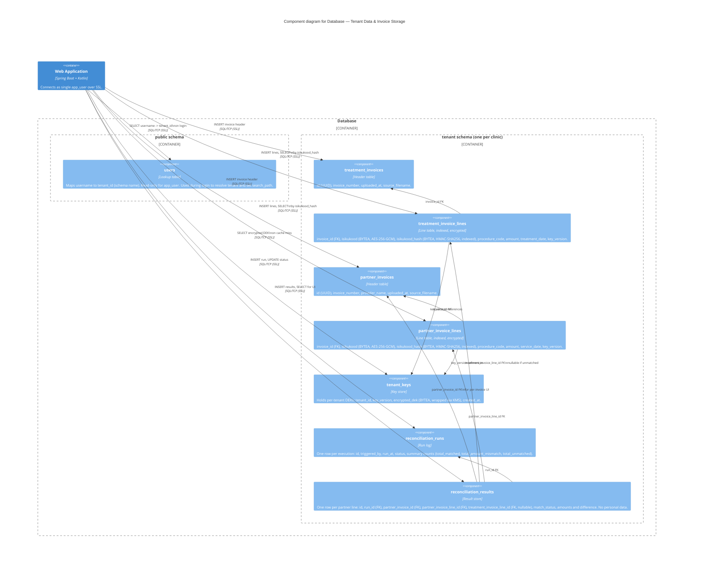

```mermaid
%%{init: {'theme': 'base', 'themeVariables': {'lineColor': '#999999'}}}%%
C4Component
    title Component diagram for Database — Tenant Data & Invoice Storage

    Container(spring_boot, "Web Application", "Spring Boot + Kotlin", "Connects as single app_user over SSL.")

    Container_Boundary(postgres, "Database") {
        Container_Boundary(public_schema, "public schema") {
            Component(users_table, "users", "Lookup table", "Maps username to tenant_id (schema name). Read-only for app_user. Used during login to resolve tenant and set search_path.")
        }

        Container_Boundary(tenant_schema, "tenant schema (one per clinic)", "Schema name = tenant_id from JWT. search_path routes all tenant queries here.") {
            Component(treatment_table, "treatment_invoices", "Header table", "id (UUID), invoice_number, uploaded_at, source_filename.")
            Component(treatment_lines, "treatment_invoice_lines", "Line table, indexed, encrypted", "invoice_id (FK), isikukood (BYTEA, AES-256-GCM), isikukood_hash (BYTEA, HMAC-SHA256, indexed), procedure_code, amount, treatment_date, key_version.")
            Component(partner_table, "partner_invoices", "Header table", "id (UUID), invoice_number, provider_name, uploaded_at, source_filename.")
            Component(partner_lines, "partner_invoice_lines", "Line table, indexed, encrypted", "invoice_id (FK), isikukood (BYTEA, AES-256-GCM), isikukood_hash (BYTEA, HMAC-SHA256, indexed), procedure_code, amount, service_date, key_version.")
            Component(keys_table, "tenant_keys", "Key store", "Holds per-tenant DEKs: tenant_id, key_version, encrypted_dek (BYTEA, wrapped via KMS), created_at.")
            Component(recon_runs, "reconciliation_runs", "Run log", "One row per execution: id, triggered_by, run_at, status, summary counts (total_matched, total_amount_mismatch, total_unmatched).")
            Component(recon_results, "reconciliation_results", "Result store", "One row per partner line: id, run_id (FK), partner_invoice_id (FK), partner_invoice_line_id (FK), treatment_invoice_line_id (FK, nullable), match_status, amounts and difference. No personal data.")
        }
    }

    Rel(spring_boot, users_table, "SELECT username -> tenant_id\non login", "SQL/TCP (SSL)")
    Rel(spring_boot, treatment_table, "INSERT invoice header", "SQL/TCP (SSL)")
    Rel(spring_boot, treatment_lines, "INSERT lines, SELECT\nby isikukood_hash", "SQL/TCP (SSL)")
    Rel(spring_boot, partner_table, "INSERT invoice header", "SQL/TCP (SSL)")
    Rel(spring_boot, partner_lines, "INSERT lines, SELECT\nby isikukood_hash", "SQL/TCP (SSL)")
    Rel(spring_boot, keys_table, "SELECT encrypted DEK\non cache miss", "SQL/TCP (SSL)")
    Rel(spring_boot, recon_runs, "INSERT run, UPDATE status", "SQL/TCP (SSL)")
    Rel(spring_boot, recon_results, "INSERT results, SELECT for UI", "SQL/TCP (SSL)")
    Rel(treatment_lines, treatment_table, "invoice_id FK")
    Rel(partner_lines, partner_table, "invoice_id FK")
    Rel(treatment_lines, keys_table, "key_version references")
    Rel(partner_lines, keys_table, "key_version references")
    Rel(recon_results, recon_runs, "run_id FK")
    Rel(recon_results, partner_table, "partner_invoice_id FK\nfor per-invoice UI")
    Rel(recon_results, partner_lines, "partner_invoice_line_id FK")
    Rel(recon_results, treatment_lines, "treatment_invoice_line_id FK\nnullable if unmatched")
```
