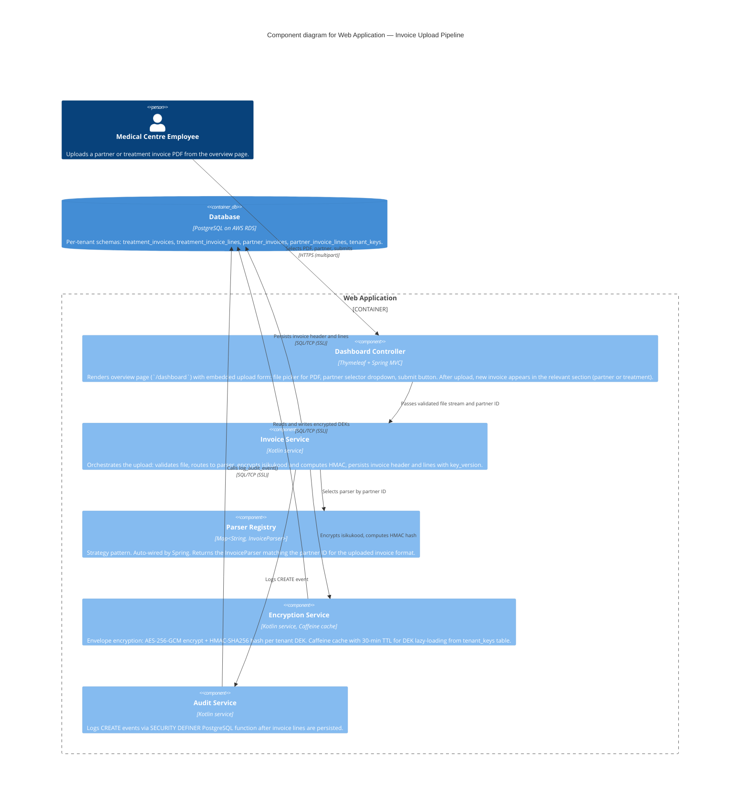

```mermaid
%%{init: {'theme': 'base', 'themeVariables': {'lineColor': '#999999'}}}%%
C4Component
    title Component diagram for Web Application — Invoice Upload Pipeline

    Person(employee, "Medical Centre Employee", "Uploads a partner or treatment invoice PDF from the overview page.")

    Container_Boundary(spring_boot, "Web Application") {
        Component(dashboard, "Dashboard Controller", "Thymeleaf + Spring MVC", "Renders overview page (`/dashboard`) with embedded upload form: file picker for PDF, partner selector dropdown, submit button. After upload, new invoice appears in the relevant section (partner or treatment).")

        Component(invoice_svc, "Invoice Service", "Kotlin service", "Orchestrates the upload: validates file, routes to parser, encrypts isikukood and computes HMAC, persists invoice header and lines with key_version.")

        Component(parser_registry, "Parser Registry", "Map<String, InvoiceParser>", "Strategy pattern. Auto-wired by Spring. Returns the InvoiceParser matching the partner ID for the uploaded invoice format.")

        Component(encryption_svc, "Encryption Service", "Kotlin service, Caffeine cache", "Envelope encryption: AES-256-GCM encrypt + HMAC-SHA256 hash per tenant DEK. Caffeine cache with 30-min TTL for DEK lazy-loading from tenant_keys table.")

        Component(audit_svc, "Audit Service", "Kotlin service", "Logs CREATE events via SECURITY DEFINER PostgreSQL function after invoice lines are persisted.")
    }

    ContainerDb(postgres, "Database", "PostgreSQL on AWS RDS", "Per-tenant schemas: treatment_invoices, treatment_invoice_lines, partner_invoices, partner_invoice_lines, tenant_keys.")

    Rel(employee, dashboard, "Selects PDF, partner, submits", "HTTPS (multipart)")
    Rel(dashboard, invoice_svc, "Passes validated file stream and partner ID")
    Rel(invoice_svc, parser_registry, "Selects parser by partner ID")
    Rel(invoice_svc, encryption_svc, "Encrypts isikukood, computes HMAC hash")
    Rel(invoice_svc, audit_svc, "Logs CREATE event")
    Rel(invoice_svc, postgres, "Persists invoice header and lines", "SQL/TCP (SSL)")
    Rel(encryption_svc, postgres, "Reads and writes encrypted DEKs", "SQL/TCP (SSL)")
    Rel(audit_svc, postgres, "Calls log_audit_event()", "SQL/TCP (SSL)")
```
