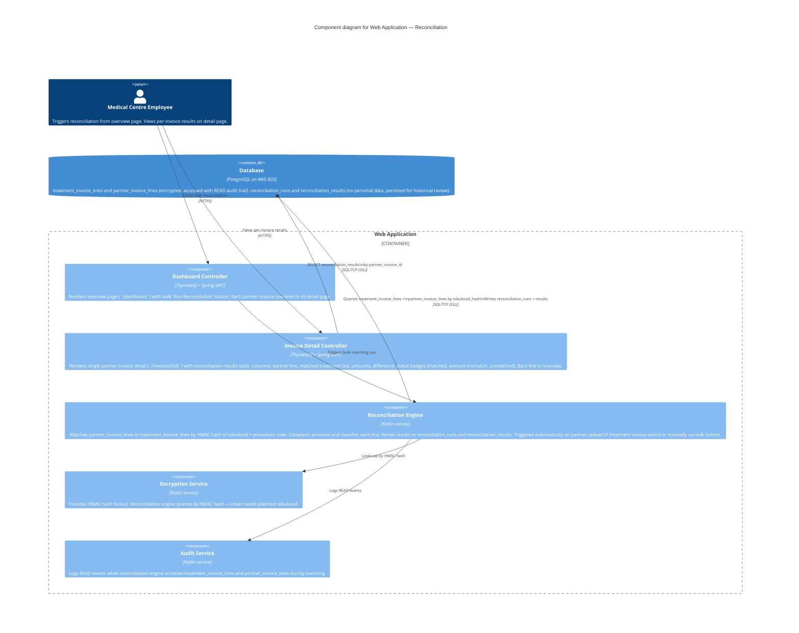

```mermaid
%%{init: {'theme': 'base', 'themeVariables': {'lineColor': '#999999'}}}%%
C4Component
    title Component diagram for Web Application — Reconciliation

    Person(employee, "Medical Centre Employee", "Triggers reconciliation from overview page. Views per-invoice results on detail page.")

    Container_Boundary(spring_boot, "Web Application") {
        Component(dashboard, "Dashboard Controller", "Thymeleaf + Spring MVC", "Renders overview page (`/dashboard`) with bulk 'Run Reconciliation' button. Each partner invoice row links to its detail page.")

        Component(detail, "Invoice Detail Controller", "Thymeleaf + Spring MVC", "Renders single partner invoice detail (`/invoices/{id}`) with reconciliation results table. Columns: partner line, matched treatment line, amounts, difference, status badges (matched, amount mismatch, unmatched). Back link to overview.")

        Component(recon_engine, "Reconciliation Engine", "Kotlin service", "Matches partner_invoice_lines to treatment_invoice_lines by HMAC hash of isikukood + procedure code. Compares amounts and classifies each line. Writes results to reconciliation_runs and reconciliation_results. Triggered automatically on partner upload (if treatment invoice exists) or manually via bulk button.")

        Component(encryption_svc, "Encryption Service", "Kotlin service", "Provides HMAC hash lookup. Reconciliation engine queries by HMAC hash — never needs plaintext isikukood.")

        Component(audit_svc, "Audit Service", "Kotlin service", "Logs READ events when reconciliation engine accesses treatment_invoice_lines and partner_invoice_lines during matching.")
    }

    ContainerDb(postgres, "Database", "PostgreSQL on AWS RDS", "treatment_invoice_lines and partner_invoice_lines (encrypted, accessed with READ audit trail). reconciliation_runs and reconciliation_results (no personal data, persisted for historical review).")

    Rel(employee, dashboard, "Clicks bulk reconciliation", "HTTPS")
    Rel(employee, detail, "Views per-invoice results", "HTTPS")
    Rel(dashboard, recon_engine, "Triggers bulk matching run")
    Rel(detail, postgres, "SELECT reconciliation_results\nby partner_invoice_id", "SQL/TCP (SSL)")
    Rel(recon_engine, encryption_svc, "Looks up by HMAC hash")
    Rel(recon_engine, audit_svc, "Logs READ events")
    Rel(recon_engine, postgres, "Queries treatment_invoice_lines +\npartner_invoice_lines by isikukood_hash\nWrites reconciliation_runs + results", "SQL/TCP (SSL)")
```
