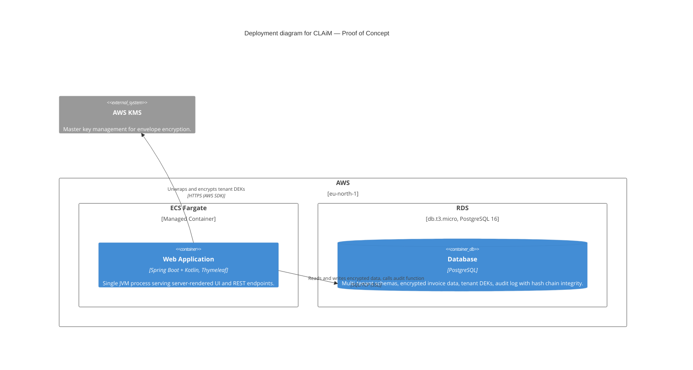

```mermaid
%%{init: {'theme': 'base', 'themeVariables': {'lineColor': '#999999'}}}%%
C4Deployment
    title Deployment diagram for CLAiM — Proof of Concept

    Deployment_Node(aws, "AWS", "eu-north-1") {
        Deployment_Node(ecs, "ECS Fargate", "Managed Container") {
            Container(spring_boot, "Web Application", "Spring Boot + Kotlin, Thymeleaf", "Single JVM process serving server-rendered UI and REST endpoints.")
        }

        Deployment_Node(rds, "RDS", "db.t3.micro, PostgreSQL 16") {
            ContainerDb(postgres, "Database", "PostgreSQL", "Multi-tenant schemas, encrypted invoice data, tenant DEKs, audit log with hash chain integrity.")
        }
    }

    System_Ext(kms, "AWS KMS", "Master key management for envelope encryption.")

    Rel(spring_boot, postgres, "Reads and writes encrypted data, calls audit function", "SQL/TCP (SSL)")
    Rel(spring_boot, kms, "Unwraps and encrypts tenant DEKs", "HTTPS (AWS SDK)")
```
