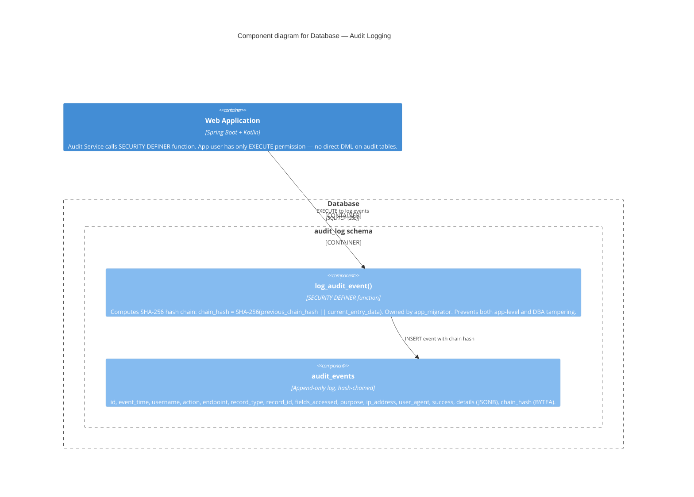

```mermaid
%%{init: {'theme': 'base', 'themeVariables': {'lineColor': '#999999'}}}%%
C4Component
    title Component diagram for Database — Audit Logging

    Container(spring_boot, "Web Application", "Spring Boot + Kotlin", "Audit Service calls SECURITY DEFINER function. App user has only EXECUTE permission — no direct DML on audit tables.")

    Container_Boundary(postgres, "Database") {
        Container_Boundary(audit_schema, "audit_log schema", "Cross-tenant. App user has zero INSERT/UPDATE/DELETE/TRUNCATE on audit_events.") {
            Component(audit_fn, "log_audit_event()", "SECURITY DEFINER function", "Computes SHA-256 hash chain: chain_hash = SHA-256(previous_chain_hash || current_entry_data). Owned by app_migrator. Prevents both app-level and DBA tampering.")

            Component(audit_table, "audit_events", "Append-only log, hash-chained", "id, event_time, username, action, endpoint, record_type, record_id, fields_accessed, purpose, ip_address, user_agent, success, details (JSONB), chain_hash (BYTEA).")
        }
    }

    Rel(spring_boot, audit_fn, "EXECUTE to log events", "SQL/TCP (SSL)")
    Rel(audit_fn, audit_table, "INSERT event with chain hash")
```
