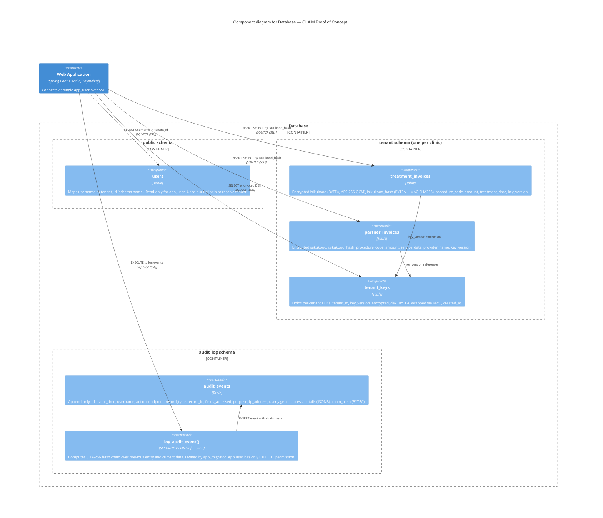

```mermaid
C4Component
    title Component diagram for Database — CLAiM Proof of Concept

    Container(spring_boot, "Web Application", "Spring Boot + Kotlin, Thymeleaf", "Connects as single app_user over SSL.")

    Container_Boundary(postgres, "Database") {
        Container_Boundary(public_schema, "public schema") {
            Component(users_table, "users", "Table", "Maps username to tenant_id (schema name). Read-only for app_user. Used during login to resolve tenant.")
        }

        Container_Boundary(tenant_schema, "tenant schema (one per clinic)", "Schema name = tenant_id from JWT. search_path routes queries here.") {
            Component(treatment_table, "treatment_invoices", "Table", "Encrypted isikukood (BYTEA, AES-256-GCM), isikukood_hash (BYTEA, HMAC-SHA256), procedure_code, amount, treatment_date, key_version.")
            Component(partner_table, "partner_invoices", "Table", "Encrypted isikukood, isikukood_hash, procedure_code, amount, service_date, provider_name, key_version.")
            Component(keys_table, "tenant_keys", "Table", "Holds per-tenant DEKs: tenant_id, key_version, encrypted_dek (BYTEA, wrapped via KMS), created_at.")
        }

        Container_Boundary(audit_schema, "audit_log schema", "Cross-tenant. App user has zero INSERT — only EXECUTE on the function.") {
            Component(audit_table, "audit_events", "Table", "Append-only. id, event_time, username, action, endpoint, record_type, record_id, fields_accessed, purpose, ip_address, user_agent, success, details (JSONB), chain_hash (BYTEA).")
            Component(audit_fn, "log_audit_event()", "SECURITY DEFINER function", "Computes SHA-256 hash chain over previous entry and current data. Owned by app_migrator. App user has only EXECUTE permission.")
        }
    }

    Rel(spring_boot, users_table, "SELECT username -> tenant_id", "SQL/TCP (SSL)")
    Rel(spring_boot, treatment_table, "INSERT, SELECT by isikukood_hash", "SQL/TCP (SSL)")
    Rel(spring_boot, partner_table, "INSERT, SELECT by isikukood_hash", "SQL/TCP (SSL)")
    Rel(spring_boot, keys_table, "SELECT encrypted DEK", "SQL/TCP (SSL)")
    Rel(spring_boot, audit_fn, "EXECUTE to log events", "SQL/TCP (SSL)")
    Rel(audit_fn, audit_table, "INSERT event with chain hash")
    Rel(treatment_table, keys_table, "key_version references")
    Rel(partner_table, keys_table, "key_version references")
```
