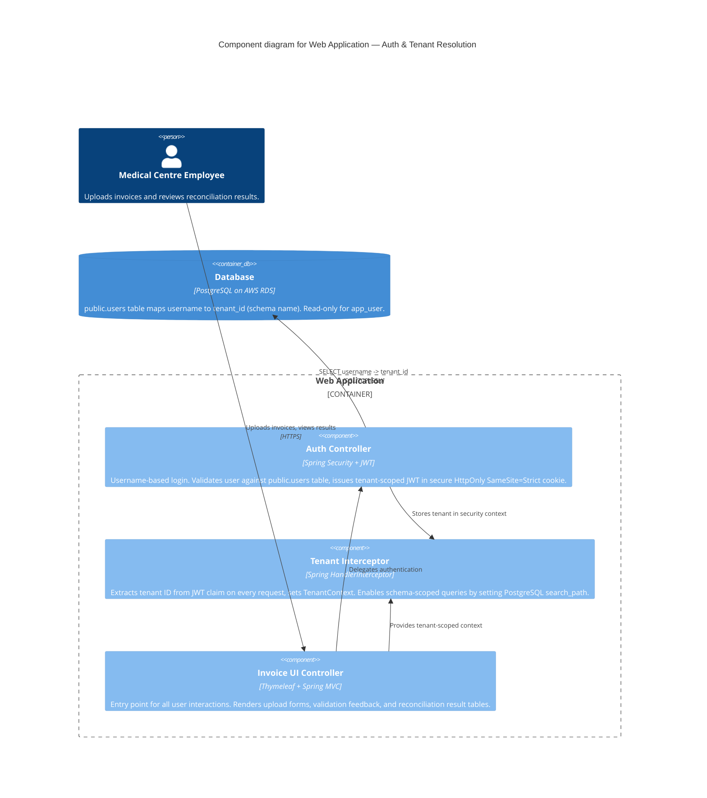

```mermaid
%%{init: {'theme': 'base', 'themeVariables': {'lineColor': '#999999'}}}%%
C4Component
    title Component diagram for Web Application — Auth & Tenant Resolution

    Person(employee, "Medical Centre Employee", "Uploads invoices and reviews reconciliation results.")

    Container_Boundary(spring_boot, "Web Application") {
        Component(auth, "Auth Controller", "Spring Security + JWT", "Username-based login. Validates user against public.users table, issues tenant-scoped JWT in secure HttpOnly SameSite=Strict cookie.")

        Component(tenant_int, "Tenant Interceptor", "Spring HandlerInterceptor", "Extracts tenant ID from JWT claim on every request, sets TenantContext. Enables schema-scoped queries by setting PostgreSQL search_path.")

        Component(ui, "Invoice UI Controller", "Thymeleaf + Spring MVC", "Entry point for all user interactions. Renders upload forms, validation feedback, and reconciliation result tables.")
    }

    ContainerDb(postgres, "Database", "PostgreSQL on AWS RDS", "public.users table maps username to tenant_id (schema name). Read-only for app_user.")

    Rel(employee, ui, "Uploads invoices, views results", "HTTPS")
    Rel(ui, auth, "Delegates authentication")
    Rel(auth, tenant_int, "Stores tenant in security context")
    Rel_Back(tenant_int, ui, "Provides tenant-scoped context")
    Rel(auth, postgres, "SELECT username -> tenant_id", "SQL/TCP (SSL)")
```
