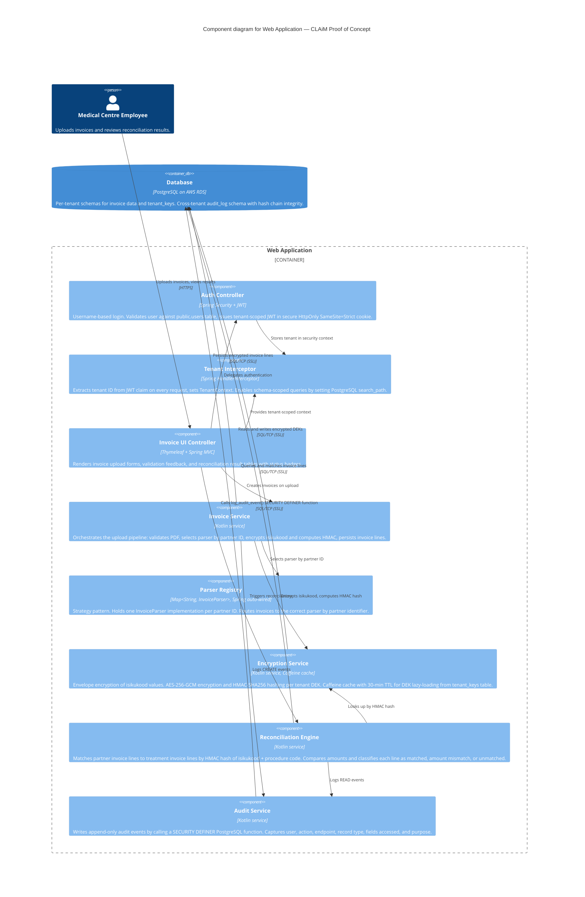

```mermaid
C4Component
    title Component diagram for Web Application — CLAiM Proof of Concept

    Person(employee, "Medical Centre Employee", "Uploads invoices and reviews reconciliation results.")

    Container_Boundary(spring_boot, "Web Application") {
        Component(auth, "Auth Controller", "Spring Security + JWT", "Username-based login. Validates user against public.users table, issues tenant-scoped JWT in secure HttpOnly SameSite=Strict cookie.")

        Component(tenant_int, "Tenant Interceptor", "Spring HandlerInterceptor", "Extracts tenant ID from JWT claim on every request, sets TenantContext. Enables schema-scoped queries by setting PostgreSQL search_path.")

        Component(ui, "Invoice UI Controller", "Thymeleaf + Spring MVC", "Renders invoice upload forms, validation feedback, and reconciliation result tables with status badges.")

        Component(invoice_svc, "Invoice Service", "Kotlin service", "Orchestrates the upload pipeline: validates PDF, selects parser by partner ID, encrypts isikukood and computes HMAC, persists invoice lines.")

        Component(parser_registry, "Parser Registry", "Map<String, InvoiceParser>, Spring auto-wired", "Strategy pattern. Holds one InvoiceParser implementation per partner ID. Routes invoices to the correct parser by partner identifier.")

        Component(encryption_svc, "Encryption Service", "Kotlin service, Caffeine cache", "Envelope encryption of isikukood values. AES-256-GCM encryption and HMAC-SHA256 hashing per tenant DEK. Caffeine cache with 30-min TTL for DEK lazy-loading from tenant_keys table.")

        Component(recon_engine, "Reconciliation Engine", "Kotlin service", "Matches partner invoice lines to treatment invoice lines by HMAC hash of isikukood + procedure code. Compares amounts and classifies each line as matched, amount mismatch, or unmatched.")

        Component(audit_svc, "Audit Service", "Kotlin service", "Writes append-only audit events by calling a SECURITY DEFINER PostgreSQL function. Captures user, action, endpoint, record type, fields accessed, and purpose.")
    }

    ContainerDb(postgres, "Database", "PostgreSQL on AWS RDS", "Per-tenant schemas for invoice data and tenant_keys. Cross-tenant audit_log schema with hash chain integrity.")

    Rel(employee, ui, "Uploads invoices, views results", "HTTPS")
    Rel(ui, auth, "Delegates authentication")
    Rel(ui, invoice_svc, "Creates invoices on upload")
    Rel(ui, recon_engine, "Triggers reconciliation")
    Rel(auth, tenant_int, "Stores tenant in security context")
    Rel_Back(tenant_int, ui, "Provides tenant-scoped context")

    Rel(invoice_svc, parser_registry, "Selects parser by partner ID")
    Rel(invoice_svc, encryption_svc, "Encrypts isikukood, computes HMAC hash")
    Rel(invoice_svc, audit_svc, "Logs CREATE events")
    Rel(invoice_svc, postgres, "Persists encrypted invoice lines", "SQL/TCP (SSL)")

    Rel(recon_engine, encryption_svc, "Looks up by HMAC hash")
    Rel(recon_engine, audit_svc, "Logs READ events")
    Rel(recon_engine, postgres, "Queries and matches invoice lines", "SQL/TCP (SSL)")

    Rel(encryption_svc, postgres, "Reads and writes encrypted DEKs", "SQL/TCP (SSL)")
    Rel(audit_svc, postgres, "Calls log_audit_event() SECURITY DEFINER function", "SQL/TCP (SSL)")
```
