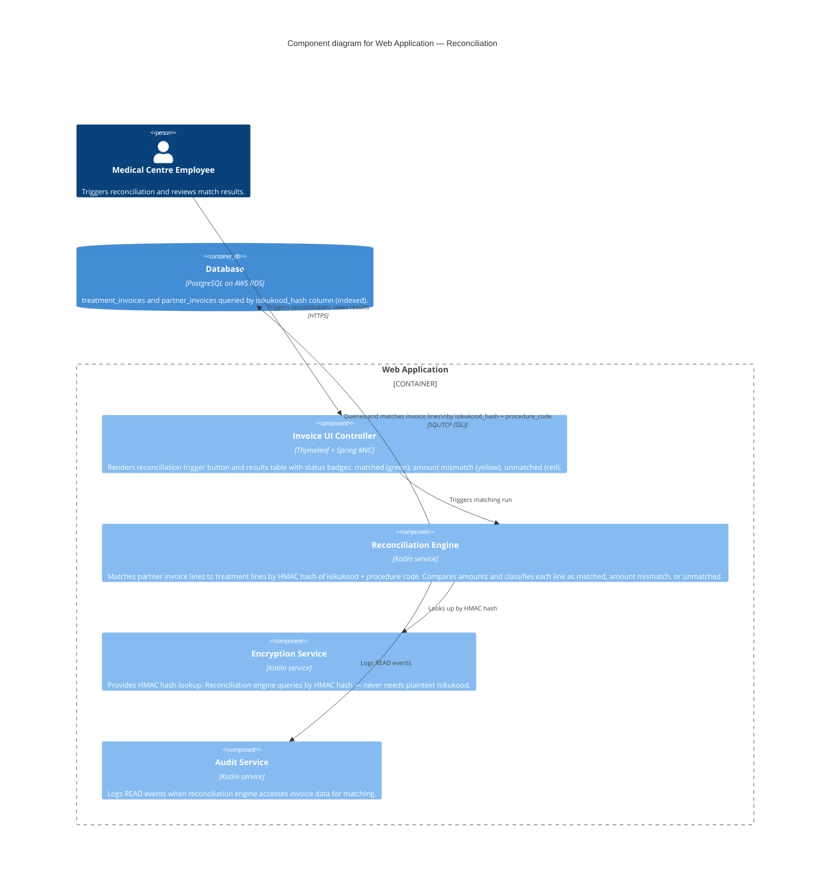

```mermaid
%%{init: {'theme': 'base', 'themeVariables': {'lineColor': '#999999'}}}%%
C4Component
    title Component diagram for Web Application — Reconciliation

    Person(employee, "Medical Centre Employee", "Triggers reconciliation and reviews match results.")

    Container_Boundary(spring_boot, "Web Application") {
        Component(ui, "Invoice UI Controller", "Thymeleaf + Spring MVC", "Renders reconciliation trigger button and results table with status badges: matched (green), amount mismatch (yellow), unmatched (red).")

        Component(recon_engine, "Reconciliation Engine", "Kotlin service", "Matches partner invoice lines to treatment lines by HMAC hash of isikukood + procedure code. Compares amounts and classifies each line as matched, amount mismatch, or unmatched.")

        Component(encryption_svc, "Encryption Service", "Kotlin service", "Provides HMAC hash lookup. Reconciliation engine queries by HMAC hash — never needs plaintext isikukood.")

        Component(audit_svc, "Audit Service", "Kotlin service", "Logs READ events when reconciliation engine accesses invoice data for matching.")
    }

    ContainerDb(postgres, "Database", "PostgreSQL on AWS RDS", "treatment_invoices and partner_invoices queried by isikukood_hash column (indexed).")

    Rel(employee, ui, "Triggers reconciliation, views results", "HTTPS")
    Rel(ui, recon_engine, "Triggers matching run")
    Rel(recon_engine, encryption_svc, "Looks up by HMAC hash")
    Rel(recon_engine, audit_svc, "Logs READ events")
    Rel(recon_engine, postgres, "Queries and matches invoice lines\nby isikukood_hash + procedure_code", "SQL/TCP (SSL)")
```
