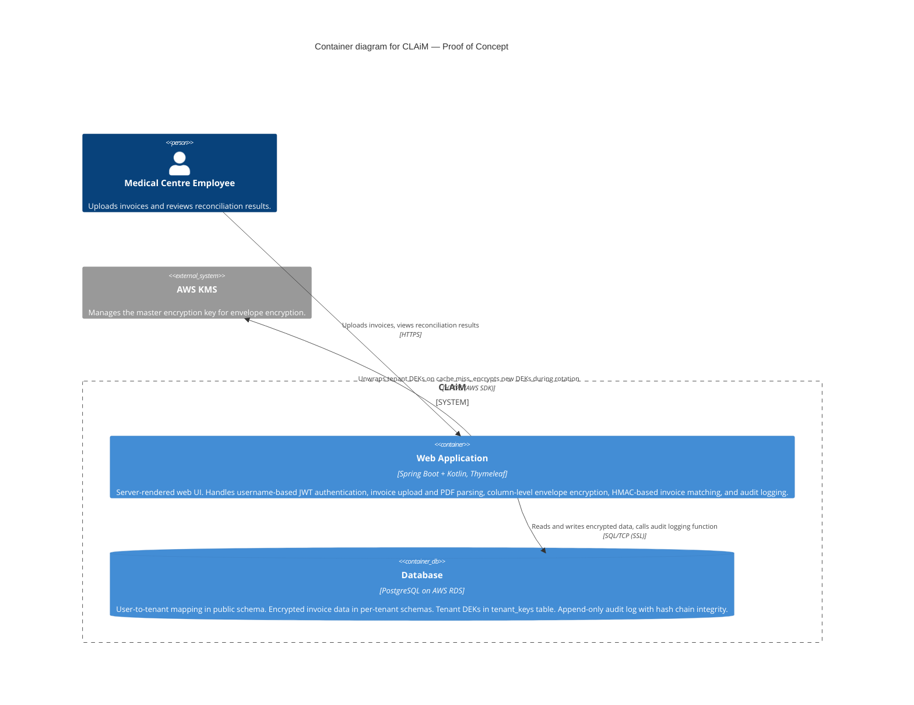

```mermaid
C4Container
    title Container diagram for CLAiM — Proof of Concept

    Person(employee, "Medical Centre Employee", "Uploads invoices and reviews reconciliation results.")

    System_Ext(kms, "AWS KMS", "Manages the master encryption key for envelope encryption.")

    System_Boundary(claim, "CLAiM") {
        Container(spring_boot, "Web Application", "Spring Boot + Kotlin, Thymeleaf", "Server-rendered web UI. Handles username-based JWT authentication, invoice upload and PDF parsing, column-level envelope encryption, HMAC-based invoice matching, and audit logging.")

        ContainerDb(postgres, "Database", "PostgreSQL on AWS RDS", "User-to-tenant mapping in public schema. Encrypted invoice data in per-tenant schemas. Tenant DEKs in tenant_keys table. Append-only audit log with hash chain integrity.")
    }

    Rel(employee, spring_boot, "Uploads invoices, views reconciliation results", "HTTPS")
    Rel(spring_boot, postgres, "Reads and writes encrypted data, calls audit logging function", "SQL/TCP (SSL)")
    Rel(spring_boot, kms, "Unwraps tenant DEKs on cache miss, encrypts new DEKs during rotation", "HTTPS (AWS SDK)")
```
