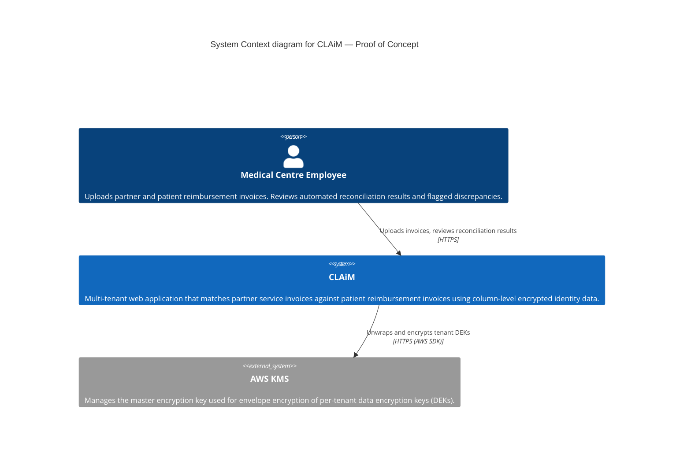

```mermaid
C4Context
    title System Context diagram for CLAiM — Proof of Concept

    Person(employee, "Medical Centre Employee", "Uploads partner and patient reimbursement invoices. Reviews automated reconciliation results and flagged discrepancies.")

    System(claim, "CLAiM", "Multi-tenant web application that matches partner service invoices against patient reimbursement invoices using column-level encrypted identity data.")

    System_Ext(kms, "AWS KMS", "Manages the master encryption key used for envelope encryption of per-tenant data encryption keys (DEKs).")

    Rel(employee, claim, "Uploads invoices, reviews reconciliation results", "HTTPS")
    Rel(claim, kms, "Unwraps and encrypts tenant DEKs", "HTTPS (AWS SDK)")
```
